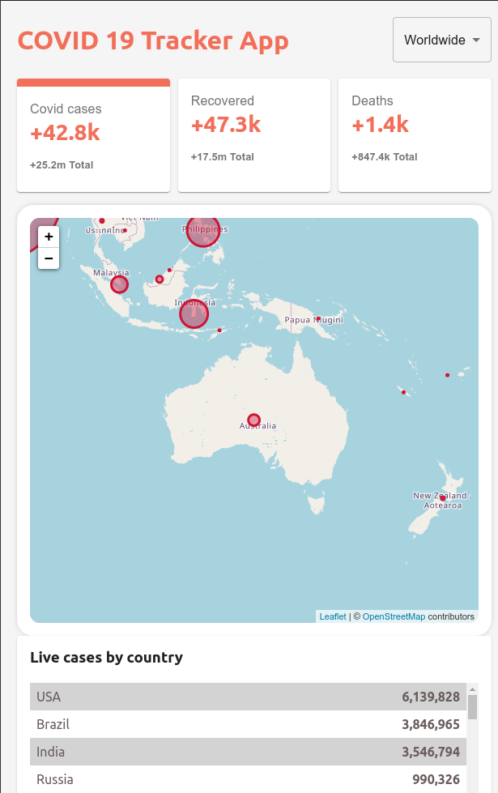
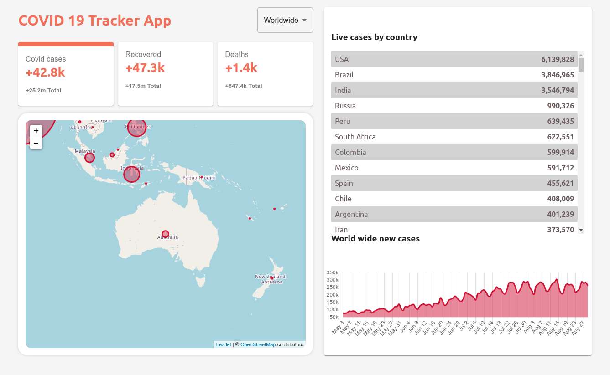

## COVID 19 Tracker App
A COVID19 tracker created in ReactJs | MaterialUI | Leaflet | ChartJS

This project was bootstrapped with [Create React App](https://github.com/facebook/create-react-app).

## Description 
Simple react covid 19 tracker with data from disease.sh

## Available Scripts

### `npm start`

Runs the app in the development mode. 
Open [http://localhost:3000](http://localhost:3000) to view it in the browser.

The page will reload if you make edits. 
You will also see any lint errors in the console.

## Screenshot

